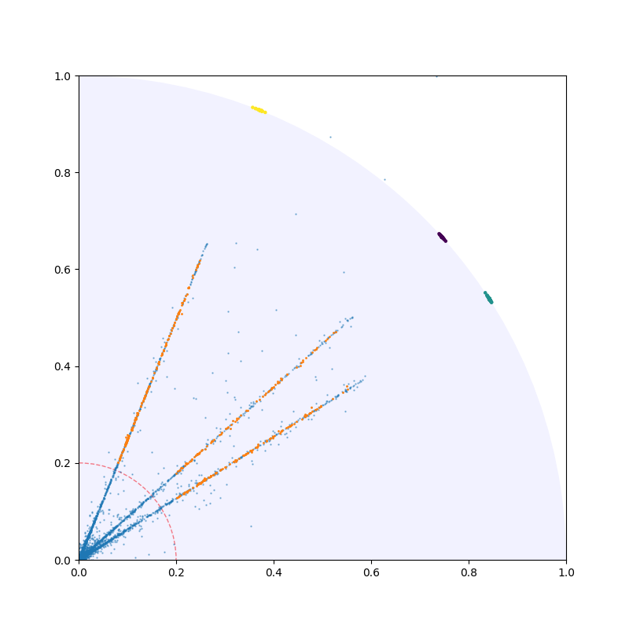
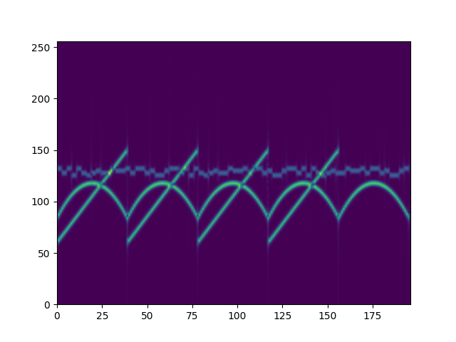
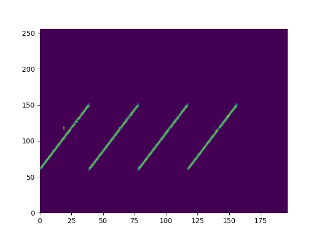
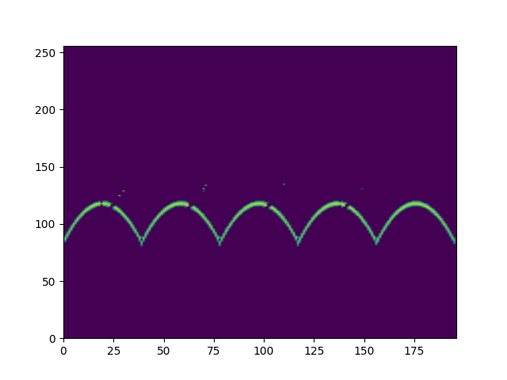
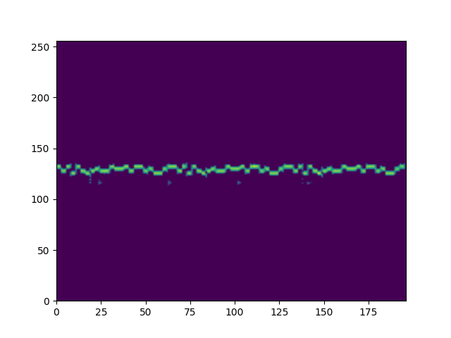

<div align="center">
<h1 align="center">

<br>Single Source Points (SSPs) Extraction and Underdetermined bling Source Separation (UBSS)</h1>
<h3>Jet Kwok (2023/09/19)</h3>


<p align="center">


</p>
</div>

---

## 📖 Table of Contents
- [📖 Table of Contents](#-table-of-contents)
- [📍 Overview](#-overview)
- [📦 Features](#-features)
- [📂 repository Structure](#-repository-structure)
- [⚙️ Modules](#modules)
- [🚀 Getting Started](#-getting-started)
    - [🔧 Installation](#-installation)
    - [🤖 Running ssps_ubss](#-running-ssps_ubss)
    - [🧪 Tests](#-tests)
- [📄 License](#-license)
- [👏 Reference](#-acknowledgments)

---


## 📍 Overview

The Python Version of [SSPs&UBSS](https://github.com/FMVPJet/ssps_ubss) Algorithm.


---

## 📦 Features


Here is the cluster visualization result of [data](https://github.com/FMVPJet/ssps_ubss/data), during SSPs.
<p style="margin-left: 2em; margin-top: -1em"> </p>


Here is the UBSS result of [data](https://github.com/FMVPJet/ssps_ubss/data).

<table class="center">
    <tr>
    <td></td>
    <td></td>
    <td></td>
    <td></td>
    </tr>
</table>


---


## 📂 Repository Structure

```sh
└── ssps_ubss/
    ├── __asserts__/
    │   └── figs/
    ├── main.py
    ├── pinv.py
    ├── requirements.txt
    ├── span.py
    ├── temp_test.py
    └── utils/
        └── utils.py

```

---


## ⚙️ Modules

<details closed><summary>Root</summary>

| File                       | Summary                                            |
| ---                        |----------------------------------------------------|
| [main.py]({file})          | Main file of this project                          |
| [pinv.py]({file})          | ISTFT                                              |
| [requirements.txt]({file}) | The requirement packages of this project           |
| [span.py]({file})          | The space theory and a modified subspace algorithm |
| [temp_test.py]({file})     | Test file                                          |
| [utils.py]({file})         | utils file                                         |

</details>

---

## 🚀 Getting Started


### 🔧 Installation

1. Clone the ssps_ubss repository:
```sh
git clone https://github.com/FMVPJet/ssps_ubss.git
```

2. Change to the project directory:
```sh
cd ssps_ubss
```

3. Install the dependencies:
```sh
pip install -r requirements.txt
```

### 🤖 Running ssps_ubss

```sh
python main.py
```

### 🧪 Tests
```sh
TODO
```


---

## 📄 License


This project is protected under the [SELECT-A-LICENSE](https://choosealicense.com/licenses) License. For more details, refer to the [LICENSE](https://choosealicense.com/licenses/) file.

---

## 👏 Reference

*[1] Pan ning, "Modulation Classification of Time-Frequency Mixed Signals Based on Semantic Segmentation."*

*[2] 周君琪. 欠定盲源分离混合矩阵估计及源信号恢复算法*

*[3] README.md file is created by [README-AI](https://github.com/eli64s/readme-ai).*

[**Return**](#Top)

---

